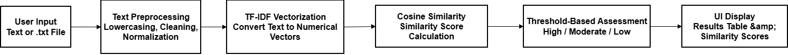
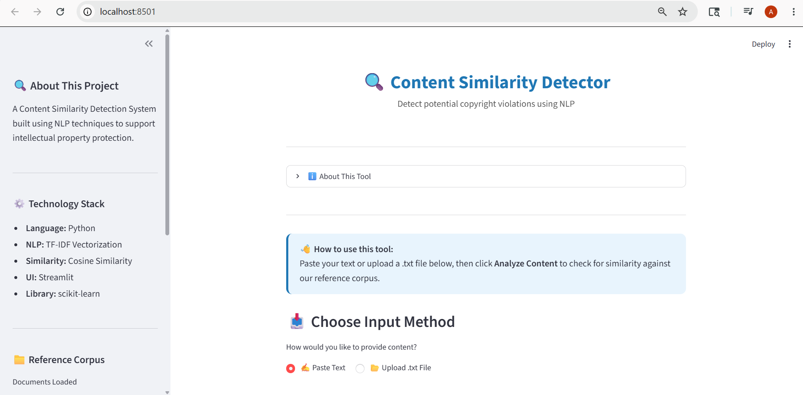
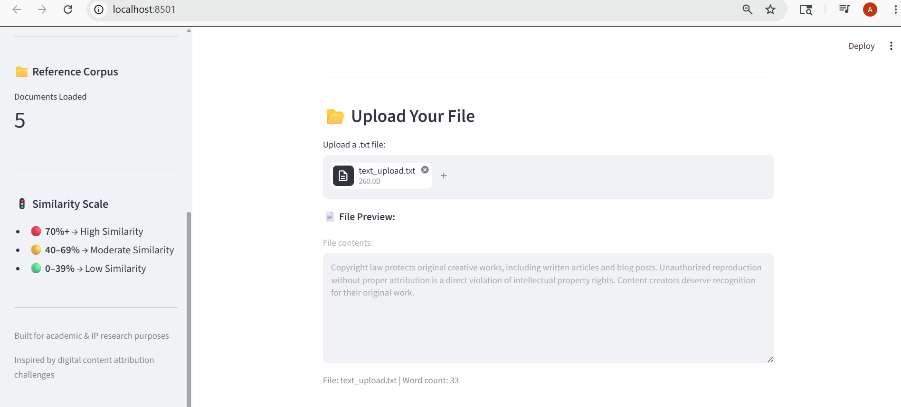
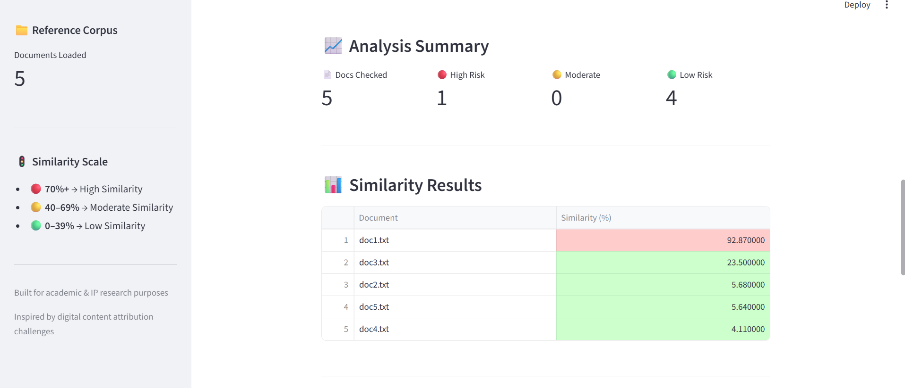
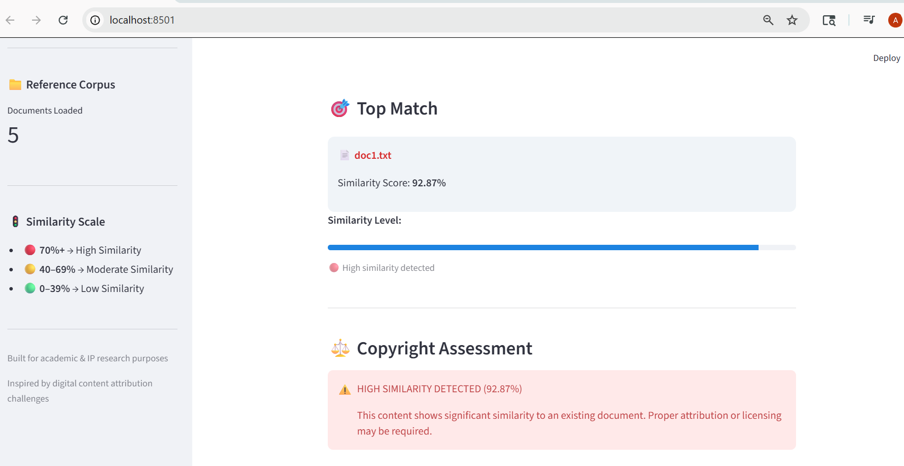

# 🔍 Content Similarity Detection System
## An NLP-Powered Tool for Digital Content Attribution and Intellectual Property Awareness

---

## 📌 Introduction

The **Content Similarity Detection System** is a Python-based application that automatically detects textual similarity between submitted content and a reference corpus of documents. Built using core Natural Language Processing techniques, it helps identify potentially similar content that may require further review for attribution or copyright concerns.

The project is inspired by challenges in digital content attribution and intellectual property protection discussed by organizations such as **WIPO (World Intellectual Property Organization)**. It is designed for academic research and educational purposes, demonstrating how NLP techniques can support content monitoring workflows.

Whether you are a content creator, publisher, or researcher — this tool provides instant, explainable similarity scores with clear assessment levels to guide manual review decisions.

---

## ✨ Features

- Compare user content against a local reference corpus
- Upload `.txt` files or paste text directly
- TF-IDF based text vectorization
- Cosine similarity scoring per document
- Automated similarity level assessment
- Color coded results table
- Interactive Streamlit interface
- Edge case handling for empty, short, and invalid inputs
- Fast and lightweight implementation

---

## ⚙️ How It Works



```
User Input (Text or .txt File)
            ↓
    Text Preprocessing
    (lowercase, punctuation removal, normalization)
            ↓
    TF-IDF Vectorization
    (converts text into numerical vectors)
            ↓
    Cosine Similarity Calculation
    (measures angle between vectors)
            ↓
    Similarity Scores per Document
            ↓
    Threshold-Based Similarity Assessment
    (High / Moderate / Low Similarity)
            ↓
    Results Displayed in UI
```

---

## 🚦 Similarity Scale

| Score | Similarity Level | Assessment |
|---|---|---|
| 70% and above | 🔴 High Similarity | Content shows strong overlap. Manual review and proper attribution recommended. |
| 40% — 69% | 🟡 Moderate Similarity | Some overlap detected. Review recommended before publishing. |
| 0% — 39% | 🟢 Low Similarity | Content appears largely original. No major concerns detected. |

> **Note:** Higher similarity scores may indicate the need for manual review and proper attribution. This tool measures textual similarity only and does not determine legal copyright infringement.

---

## 🛠️ Technology Stack

| Component | Technology |
|---|---|
| Language | Python 3 |
| NLP & ML | scikit-learn |
| Similarity Method | TF-IDF + Cosine Similarity |
| UI Framework | Streamlit |
| Text Processing | Python `re` module |

---

## 📁 Project Structure

```
Plagiarism_Checker/
├── app.py              → Streamlit UI and user interaction
├── preprocessing.py    → Text cleaning and normalization
├── similarity.py       → TF-IDF vectorization and similarity logic
├── test.py             → Terminal-based test suite
├── data/               → Reference corpus documents
│   ├── doc1.txt        → Blog / copyright content
│   ├── doc2.txt        → Technology article
│   ├── doc3.txt        → IP and WIPO related content
│   ├── doc4.txt        → Product description
│   └── doc5.txt        → Academic / research content
├── requirements.txt    → Python dependencies
└── README.md           → Project documentation
```

---
## 📸 Screenshots

### 🏠 Home



### 📊 Analysis Results



---

## 🚀 Installation — For Users

### Step 1 — Clone the Repository

```bash
git clone https://github.com/Amina-Naseer-Devs/Plagiarism_Checker.git
cd Plagiarism_Checker
```

### Step 2 — Install Dependencies

```bash
pip install -r requirements.txt
```

### Step 3 — Run the App

```bash
streamlit run app.py
```

### Step 4 — Open in Browser

```
http://localhost:8501
```

---

## 📖 Usage Guide

**Option 1 — Paste Text**
1. Select `✍️ Paste Text` input method
2. Paste your article, blog post, or product description
3. Click `🔍 Analyze Content`
4. View similarity scores and assessment

**Option 2 — Upload File**
1. Select `📂 Upload .txt File` input method
2. Upload any plain text `.txt` file
3. Click `🔍 Analyze Content`
4. View similarity scores and assessment

---

## 📂 Customizing the Reference Corpus

The `/data` folder contains the reference documents your content is compared against.
You can fully customize this to match your real world use case.

**To add your own documents:**
1. Create any `.txt` file with your content
2. Place it inside the `/data` folder
3. Restart the app — it will automatically detect the new file

**Example use cases:**
- A blogger can add their published articles to detect if someone copied them
- A company can add their product descriptions to monitor duplication
- A publisher can add their article archive to check submitted content against it
- A university can add reference materials to check student submissions

> The more documents you add to `/data`, the more accurate and meaningful 
> the similarity scores become.

 ---

## 🧑‍💻 Installation — For Contributors

### Step 1 — Fork and Clone

```bash
git clone https://github.com/Amina-Naseer-Devs/Plagiarism_Checker.git
cd Plagiarism_Checker
```

### Step 2 — Install Dependencies

```bash
pip install -r requirements.txt
```

### Step 3 — Understand the Module Structure

| File | Responsibility |
|---|---|
| `preprocessing.py` | All text cleaning logic lives here |
| `similarity.py` | All NLP and similarity logic lives here |
| `app.py` | Only UI and user interaction lives here |

Keep responsibilities separated. Do not mix UI logic into `similarity.py` or NLP logic into `app.py`.

### Step 4 — Run Tests Before Making Changes

```bash
python test.py
```

All tests must pass before submitting any pull request.

---

## 🤝 Contributor Expectations

- **Open an issue first** — Describe what you want to fix or add. Wait for discussion before coding.
- **One feature per pull request** — Keep PRs small and focused.
- **Test your changes** — Run `test.py` and ensure all existing tests still pass.
- **Follow existing code style** — Lowercase function names with underscores. Comment above each function.
- **Update README** — If your change affects usage or installation, update this file.

---

## ⚠️ Known Issues

- Short texts under 10 words may produce unreliable similarity scores due to sparse TF-IDF vectors
- File upload supports `.txt` files only — PDF and DOCX not yet supported
- Analysis results are not saved between sessions
- Optimized for English language text only
- Similarity scores depend heavily on the size and quality of the reference corpus

---

## 🚧 Limitations

- Uses **lexical similarity** rather than semantic understanding — meaning it compares words, not meaning
- Cannot effectively detect **paraphrased content** where ideas are reworded significantly
- Does **not determine legal copyright infringement** — results require human review
- Accuracy depends heavily on the quality and size of the reference corpus
- English text only — other languages will produce inaccurate results

---

## 📊 System Evaluation

The system was tested on 7 sample inputs covering different content types:

| Test Case | Expected Result | Actual Result |
|---|---|---|
| High similarity text | High similarity detected | ✅ 72.88% — Correct |
| Unrelated content | Low similarity | ✅ 7.99% — Correct |
| Empty input | Error message | ✅ Handled correctly |
| Too short input | Error message | ✅ Handled correctly |
| Symbols only | Error message | ✅ Handled correctly |
| Numbers only | Error message | ✅ Handled correctly |
| WIPO related content | Moderate similarity | ✅ 54.85% — Correct |

All 7 test cases produced expected results. System correctly 
distinguishes between high, moderate, and low similarity content.

> Note: Results depend on reference corpus size and content. 
> A larger corpus will produce more meaningful scores.

---

## 🔮 Future Enhancements

- Support PDF and DOCX file uploads
- Add semantic similarity using transformer models (e.g. BERT, Sentence-BERT)
- Store historical analysis results in a database
- Multi-language support
- Web crawling to build larger reference corpora automatically
- Export similarity reports as PDF
- User authentication for multi-user environments

---

## 🌐 Real World Applications

- **Blog and article monitoring** — Detect unauthorized reuse of published content
- **Product description duplication** — Identify copied e-commerce listings
- **Academic integrity checking** — Flag potentially similar research excerpts
- **Digital publishing compliance** — Support attribution and licensing decisions

---

## 👤 Author

**Amina Naseer**
BS Software Engineering Student
National University of Modern Languages (NUML)
📧 numl-s24-35647@numls.edu.pk
🔗 [GitHub Profile](https://github.com/Amina-Naseer-Devs)

---

## 🤝 Ethical Use Statement

This system is designed to **assist human review** rather than 
replace legal, academic, or editorial judgment.

- Similarity scores are indicators only — not legal determinations
- Results should always be reviewed by a qualified human
- The system does not access or store any user submitted content
- Intended for academic research and educational purposes only

---

## 📄 License

This project is licensed under the MIT License.
See the [LICENSE](LICENSE) file for full details. 
Built for academic and intellectual property research purposes.

---

*For questions or suggestions, open an issue on GitHub.*
